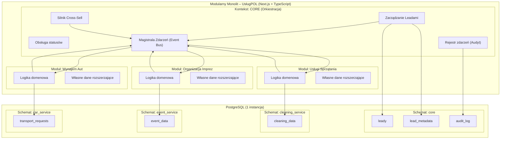

# UsługPOL – Modular Monolith (Zadanie Rekrutacyjne)

## 1. Cel projektu

Celem projektu jest **Core system** dla holdingu usługowego UsługPOL w architekturze **Modular Monolith** z wyraźnymi **Bounded Contexts**, zachowując autonomię spółek‑córek i jednocześnie wspierając sprzedaż krzyżową (cross‑sell).

Projekt realizuje MVP nastawione na:

* centralne zarządzanie leadami,
* asynchroniczną komunikację zdarzeniową,
* izolację domen i danych,
* gotowość do przyszłego wydzielenia modułów do mikroserwisów.

---

## 2. Kontekst biznesowy

UsługPOL to marka parasolowa obejmująca trzy obszary:

* sprzątanie (`cleaning`),
* organizacja imprez (`event`),
* wynajem aut (`car`).

Problem biznesowy:

* zespoły i dane są rozdzielone,
* klient widzi jedną markę,
* brakuje mechanizmu wykrywania okazji cross‑sell między spółkami.

Przykład:

* lead eventowy oddalony od miasta/biura powinien generować sugestię wynajmu aut.

---

## 3. Zakres zrealizowanego MVP

### Core (`packages/core`)

* przyjmowanie leadów z kanałów: `phone`, `email`, `form`,
* kategoryzacja leadów: `cleaning`, `event`, `car`,
* statusy: `new → qualified → converted`,
* rejestrowanie i publikacja zdarzeń domenowych,
* wykrywanie okazji cross‑sell,
* audyt działań.

### Event Service (`packages/event-service`)

* subskrypcja leadów eventowych,
* własny model danych `event_data`,
* rozszerzenie danych o pola domenowe (`eventDate`, `location`, `eventType`, `guestCount`, `budget`),
* zgłaszanie feedbacku do Core (opportunity).

### Car Service (`packages/car-service`)

* subskrypcja leadów car,
* własny model danych `transport_requests`,
* obsługa propozycji cross‑sell,
* decyzje o akceptacji/odrzuceniu okazji.

### Web UI (`apps/web`)

* dashboard operacyjny dla MVP,
* intake leadów,
* podgląd leadów i opportunities,
* edycja danych event/car,
* zmiana statusu leada.

---

## 4. Architektura

### Diagram architektury



### Styl architektoniczny

* **Modular Monolith** w monorepo (Turborepo),
* wyraźny podział na konteksty domenowe (`core`, `event-service`, `car-service`),
* komunikacja przez kontrakty i eventy, nie przez bezpośrednie zależności między usługami.

### Komunikacja asynchroniczna

* użyty **in-memory EventBus** jako adapter MVP,
* Core publikuje zdarzenia (`core.lead.created`, `core.lead.status_changed`, `core.opportunity.detected`),
* moduły domenowe subskrybują tylko potrzebne eventy,
* architektura przygotowana do podmiany EventBus na zewnętrzny broker (np. Kafka) bez przebudowy logiki domenowej.

### Izolacja i granice modułów

* Core nie zna szczegółów implementacyjnych usług,
* moduły biznesowe nie czytają bezpośrednio API/tabel innych modułów,
* zastosowano reguły lint (`no-restricted-imports`) pilnujące granic kontekstów.

---

## 5. Model danych i baza

### PostgreSQL

Jedna instancja PostgreSQL, logiczny podział na schematy:

* `core`
* `event_service`
* `car_service`
* `cleaning_service`

### ORM i migracje

* Drizzle ORM,
* osobne konfiguracje migracji per bounded context:

  * `drizzle.core.config.ts`
  * `drizzle.event-service.config.ts`
  * `drizzle.car-service.config.ts`

---

## 6. Reguły cross‑sell (MVP)

Zaimplementowane reguły obejmują:

* analizę kontekstową opisu/lokalizacji leada eventowego,
* regułę odległości (`> 50 km`) dla sugestii `car`,
* geolokalizację względem biura (konfigurowalne ENV),
* pętlę feedbacku z modułu event do Core (zgłoszenie potrzeby transportu).

---

## 7. Widoczność danych

* Core: pełny wgląd w leady i audit.
* Moduł domenowy: tylko własne dane + rekomendacje cross‑sell przekazane przez Core.
* Brak bezpośredniej zależności domena → domena.

---

## 8. Stack technologiczny

* Monorepo: **Turborepo**
* Framework: **Next.js (App Router)**
* Język: **TypeScript**
* DB: **PostgreSQL**
* ORM: **Drizzle ORM**
* UI: komponenty **ShadCN**

---

## 9. Struktura repozytorium

```txt
apps/
  web/                      # UI + endpointy App Router
packages/
  core/                     # orkiestracja leadów, statusy, cross-sell, audit
  event-service/            # domena event
  car-service/              # domena car
  shared/                   # contracts, event bus, db bootstrap
  cleaning-service/         # miejsce na dalszy rozwój
```

---

## 10. Uruchomienie lokalne

### Wymagania

* Node.js 18+
* npm 10+
* Docker (dla PostgreSQL)

### Kroki

1. Instalacja zależności:

```sh
npm install
```

2. Uruchomienie PostgreSQL:

```sh
docker compose up -d
```

3. Konfiguracja `.env`:

```env
DATABASE_URL=<url_do_bazy_postgresql>
USLUGPOL_DISTANCE_THRESHOLD_KM=50
USLUGPOL_OFFICE_CITY=Krakow
USLUGPOL_OFFICE_LAT=50.0647
USLUGPOL_OFFICE_LON=19.9450
```

4. Migracje:

```sh
npm run db:migrate
```

5. Start aplikacji:

```sh
npm run dev
```

Aplikacja web: `http://localhost:4000`

---

## 11. Najważniejsze komendy

```sh
npm run dev
npm run build
npm run lint
npm run check-types

npm run db:generate
npm run db:generate:all
npm run db:migrate
```

---

## 12. Decyzje projektowe i kompromisy

* Wybrano in-memory EventBus dla szybkości MVP i czytelności architektury.
* UI jest celowo operacyjne, nie produkcyjne.
* Priorytetem była poprawna architektura i granice modułów, nie pełne pokrycie edge-case’ów.

---

## 13. Kierunki dalszego rozwoju

* Podmiana EventBus na Kafka/RabbitMQ.
* Outbox pattern dla gwarancji dostarczenia eventów.
* Silniejsze RBAC i separacja widoków per spółka.
* Testy integracyjne cross-context.
* Wydzielenie modułów do mikroserwisów bez zmiany kontraktów domenowych.

---

## 14. Podsumowanie

Projekt demonstruje:

* świadome projektowanie modularnego monolitu,
* separację kontekstów domenowych,
* event‑driven orchestration,
* gotowość do skalowania i wydzielenia mikroserwisów,
* biznesowe podejście do problemu cross‑sell w holdingu.
